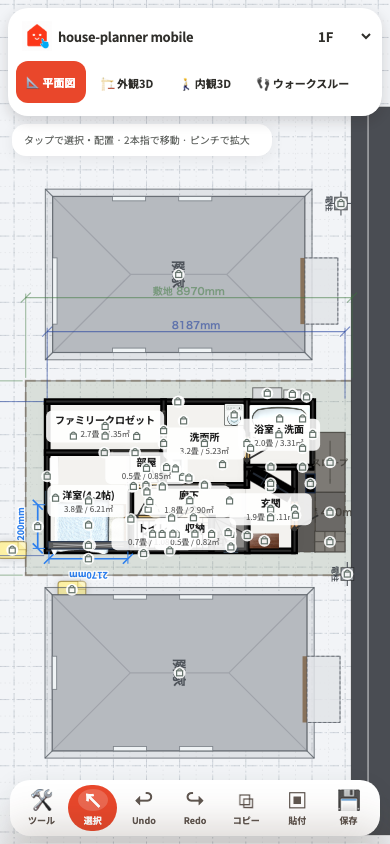
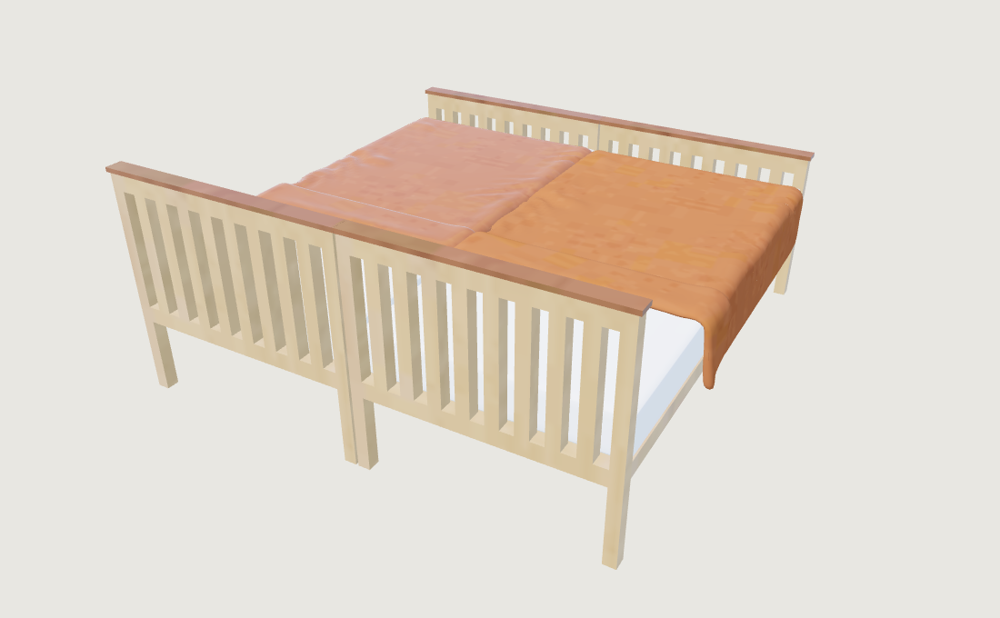
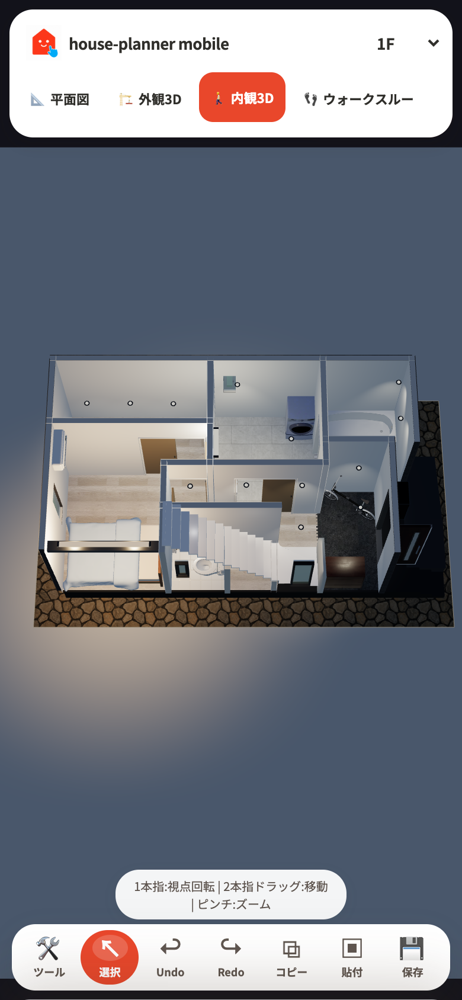
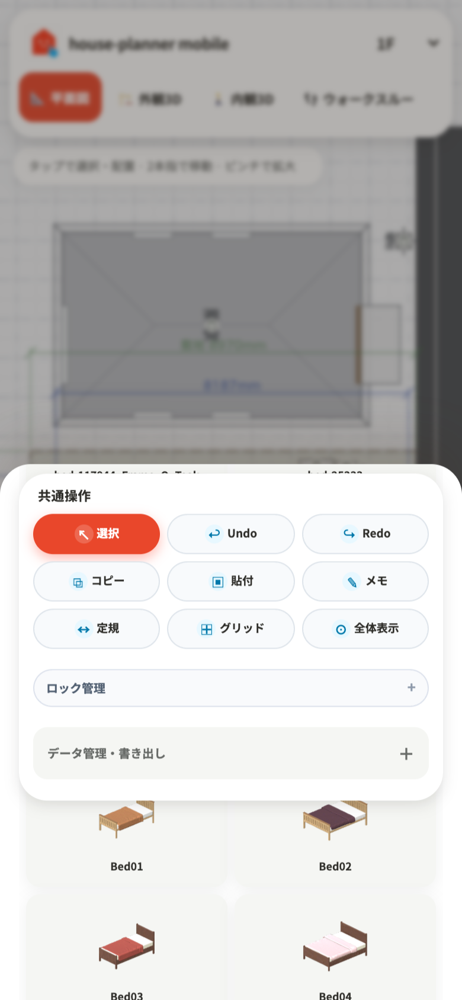
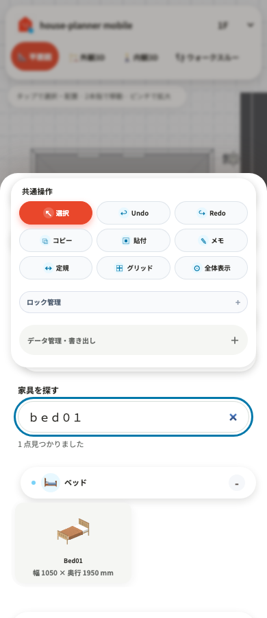
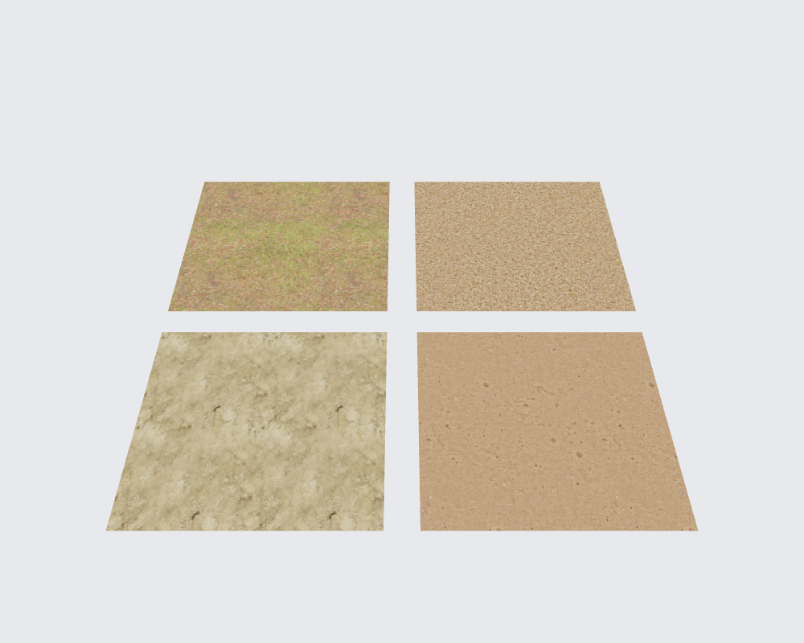

# 住宅シミュレーション品質の改善 — 2026-09-07

## プロダクトの軸

「スマホで、建てる前の暮らしを確かめる」。図面の寸法、家具の占有、視線・動線、素材の印象を同じプラン上で行き来できることを価値とする。想定するベネフィットは、住宅の相談前に希望を具体化できること、配置や広さの思い違いを減らすこと、家族や設計者と共通の空間イメージを持てること。

リアルタイム3Dは寸法・配置の確認、AI画像は仕上がりのイメージ共有という役割。見栄えのために寸法や既存プランの向きを暗黙に変えない。

## 今回の実装

- モバイル上段はブランドと階、下段は表示・出力操作の横スクロール。平面・外観・内観が320px幅から見える。
- 家具を形で探せる2列サムネイルカード、共通コントロールの角丸・色・フォーカス、白いウォークスルー操作盤。
- 縦長画面の内観3Dは狭い側の画角からカメラ距離を決め、住宅の見切れを防止。
- データ管理は開閉式にし、家具カード用のスクロール領域を確保。タッチ端末のホバープレビューは表示しない。
- モバイル向けの操作説明。ガイドの横幅を避ける初期カメラ計算を修正し、非同期のサンプル読込後に住宅の範囲へフィット。
- ロック表示を小さな単色の記号へ変更し、部屋名・家具への重なりを軽減。
- Unity由来家具の `roughnessFactor=0` をロード時に補正。粗さマップを持つ混合素材は倍率を1へ戻す。寝具・明示的な布素材は粗さ0.94、非金属にして、鏡面反射を除去。色・法線テクスチャは保持。
- 素材補正とシャドウ設定をキャッシュ前に適用し、個別クローンとインスタンス描画で一致。
- `GLTF_MODEL_CONFIG` を持つモデルは個別描画へ回し、未選択時に向きや素材設定が無視される問題を解消。
- モデルの一部を取り除くときに、キャッシュと共有しているジオメトリを破棄しない。
- モデル読込中もモバイルの軽量描画を使い、読込完了時に高解像度・AOへ復帰。
- 非表示タブで3D描画処理を停止。既存の操作中低解像度・静止時高解像度への復帰を維持。

## モデルの座標規約

新規アセットはメートル、Y-up、原点は底面中央、正面をglTF +Z（平面図の下側）に揃える。BlenderではZ-up・正面-YからglTFへ書き出す。既存プランの `rot` は変更しない。

既存アセットの補正は `GLTF_MODEL_CONFIG[id].rotY` で記録し、平面上面画像の `getFmpTopRotationRad` と合わせて確認する。正面はバウンディングボックスだけでは判定できないため、全モデルを一律180度回転させない。今回行ったのは描画経路の不一致解消であり、全ライブラリの正面監査・統一完了ではない。

## 車とBlenderの判断

既存セダンと未採用の `car_hatchback.glb` を同じビューで比較。ハッチバックは輪郭の密度が高い一方、窓の境界に白い三角面が残り、現時点での差し替えは行っていない。車の次の改善はガラス・塗装の境界をメッシュとして整理し、正面・側面・後方および色変更を確認すること。単純なポリゴン増加だけでは改善しない。

Blenderレンダーは有用。ただし現在の住宅形状はブラウザで組み立てているため、JSONから別実装で再構築すると建具・屋根・寸法に差が生じる。導入するなら完成したシーンのGLB、カメラ、ライトをまとめて渡す方式を採る。InstancedMeshの展開、カットアウェイ解除、画像テクスチャ、表示階の扱いを検証する必要があり、今回はレンダー入口だけを先に追加していない。

## 確認

- 既存608テスト成功（ブラウザ起動・2D/3D・ウォークスルー・AIダイアログ操作を含む）。追加回帰テスト6件成功。
- ブラウザで320×740、390×844、768×1024、1440×900の主要ボタンと住宅の収まりを確認。
- 同じ照明下で寝具の補正前後を確認。比較画像は左が補正前、右が補正後。
- Metalを使うChromiumでサンプル内観の45モデル読込成功、コンソールエラーなし、静止時DPR 2への復帰を確認。ソフトウェアGPUでの画像取得はタイムアウトしたため、GPUを有効化して再検証。
- 配信用ビルド成功。公開環境へのデプロイはしていない。
- 実機のiOS/Androidでのフレームレート、発熱、メモリ上限は未測定。ブラウザのタッチ・画面幅エミュレーションによる確認。

## 継続改善：家具選びと操作形状

家具・住設のカタログに名前・種類の検索を追加。日本語カテゴリ、モデル名、全角英数字、複数語に対応し、検索で展開したカテゴリは検索解除時に元の状態へ戻す。カードにモデルの幅・奥行き（mm）を表示し、部屋へ配置する前にサイズを比較できるようにした。

検索は既存カードを絞り込む方式で、入力のたびにDOMを作り直さない。固定の共通操作パネルの高さを監視してスクロール余白へ反映し、検索結果が少なくなっても入力欄がパネルの下へ隠れないようにする。下部ナビ・データ管理・検索欄はカプセル形状を使用する。

390pxと1440pxのブラウザで、日本語検索、全角英数字検索、該当なし、検索解除、検索結果からのツール選択を確認。今回の変更はカタログと操作UIに限定し、モデルの向きや形状は変更していない。

次に優先したい内容：

1. 家具の正面監査：代表的なベッド・ソファ・収納の2D上面画像と3Dを比較し、既存配置を保持する補正表を作る。
2. 車：ガラスと塗装の境界を修正したモデルを、4方向・色変更・モバイル描画コストで比較する。
3. Blenderへのシーン出力：完成した形状とカメラを受け渡し、ブラウザと寸法を一致させた静止画レンダーを検討する。

## 継続改善：動作中の3D品質と描画負荷

金属のmetalnessを一律0.35へ落とす処理を撤去し、モデル本来の金属度とマップを保持。布・寝具は既存の素材別補正を継続する。ポリゴン、テクスチャ、影の解像度は増やしていない。

カメラだけの移動では影マップを再利用する。シーン変更、家具操作、ドア開閉、ウォークスルーの表示対象変更、壁のカットアウェイ変更では影を更新する。N8AOがシーンを描画する場合、先行RenderPassの重複描画を省き、AOが無効なら通常パスを復帰させる。

同一サンプル・45モデル・Chromium Metalで変更前後を比較。モバイル相当の画面設定で、操作中の平均描画命令は外観3768→2617（約31%減）、内観1455→977（約33%減）、ウォークスルー2309→672。デスクトップ外観は6893→3116。解像度設定は各比較で同一。

測定はカメラを一定量回転させる合成負荷で、ウォークスルーでは移動更新を固定しドアアニメーションを除外した。フレーム時間はGPU同期を含み、実利用のFPSではない。初回のデスクトップウォークスルー時間は悪化した一方、順番を入れ替えた2組の再測定では中央値が変更前42.8/41.2ms、変更後17.2/16.4msとなった。描画命令の削減は一貫しているが、実機iOS/Androidの発熱・FPSは未測定。生データは motion-render-benchmark.json と walkthrough-repeat.json。

回帰テスト62件成功。影更新の判定、カットアウェイ、AOパス復帰、金属マップ保持を含む。

## AI画像：水彩ファサードと構造保持

実写の建築写真・生活画像・生活水彩に水彩ファサードを追加。水彩は紙肌と淡い彩色を適用し、建築の輪郭・開口部・元の透視投影を保持する指示。Xの参考投稿は403で画像を取得できず、指定された「水彩ファサード」という方向に基づくテンプレートである。

家具保持と空室化、追加禁止と生活小物追加の相反する指示を解消。画角・消失点・切断面・遮蔽順序を保持し、生成後に構造ガイドと照合する指示を追加。基準と構造ガイドの撮影間で非同期フレーム待ちをしないことで、視点や読込状態が進むことを防止。撮影失敗時は不完全なガイドを出力せずエラーを表示する。

29件の関連テスト成功。外部AIでの実画像生成と一致率測定は未実施。これは構造の保証機構やControlNetの接続ではなく、入力の整合性と指示の改善。

## 地面・基礎素材の実寸化

芝生（自然草地）、砂利、砂地（締め固め）、経年コンクリートの専用色・OpenGL法線画像を採用。出典と実寸情報は assets/textures/ground/sources.json。Poly Haven CC0素材を512pxへ縮小。色の二重乗算を除去し、法線は線形色空間、金属度0。画像1枚の実寸は草2m、砂利2.25m、砂地1.5m、コンクリート2.08m。小さな面も1回リピートに丸めない。

基礎設定に実寸素材の選択を追加し、この4素材では上面・側面の面寸法に応じて繰り返す。敷地表面にも砂地を追加。512px色＋法線のため1素材あたり非圧縮GPU容量はミップ込み概算2.7MiB（クローン分を除く）。ジオメトリ増加なし、法線のサンプリング負荷は追加される。実機FPSは未測定。任意アップロード画像の実寸自動推定は対象外。

同じ照明で各3m角の確認画像（奥：自然草地・砂利、手前：砂地・経年コンクリート）。間近での草の立体的な輪郭は平面＋法線では再現されない。

## 空気感・間接光（リアルタイム）

手続き空の地平線を画像高の72%から50%付近へ修正。IBL用の下半球は明るい空色ではなく中性色の地面反射とし、昼の上半球の彩度を控えめにする。夜の上半球は昼の中性色に寄せない。太陽の表示位置はライトの方向ベクトルから算出し、球面表示とequirectangular IBLの左右UV規約を区別。太陽高度はsin近似ではなく角度から求める。写真背景自体は変更していないため、写真中の雲・光源位置との完全一致ではない。

既存N8AOの半径を0.7mから0.35m、強度を2から1.3に調整して壁際の広い黒ずみを抑制。描画パス・サンプル数・影マップサイズ・テクスチャ解像度は増やしていない。追加GI、ボリューム光、リアルタイムレイトレーシングは導入していない。

外観・内観・ウォークスルーを同一サンプルで比較し、コンソールエラーなし。テクスチャ数は各ビューで前後同数。暖色照明と白壁の色の分離を改善したが、写真同等の品質に到達したとは評価していない。窓からの間接光の遮蔽、細部モデル、局所反射の精度には依然改善余地がある。

### 2026-09-07 共通の写真調クラウドスカイ

- 初期表示と時刻スライダーの表示を共通画像 + シェーダーに統一。雲の形状を維持し、太陽位置・夕焼け色・夜の暗さを uniform で更新。間接光の PMREM は従来どおり操作確定時に更新。
- `assets/sky/clouds-common-v1.jpg` は既存 day.jpg を参照して画像生成ツールで太陽を除去した共通空。1024×512 JPEG。左右端はシェーダーで補間。
- Chromium Metal で 0/6/12/14/16/18/22/24 時の同一 material・texture の再利用を確認。14/16/18 時は継ぎ目方向も撮影し、16/18 時の画像を目視確認。JS/GL エラーなし。
- sun-hour / sky-lighting / render-quality 計11テスト成功。デプロイなしのビルド成功。実機モバイルの FPS は未測定。
- 比較画像: [昼](common-sky-12.png)、[夕方](common-sky-18.png)、[夜](common-sky-22.png)。

### 雲タイル方式

1024×1024 の雲の濃淡画像 cloud-tile-v1.jpg を雲層へ投影。空色・地平線・太陽とは分離し、一層・一回のテクスチャ参照で表示。反転リピート、座標のゆらぎと低周波の分布調整で反復を抑える。ミップマップと最大4倍の異方性フィルタを使用。旧1774×887より画素数は約33%減少。実機FPS未測定。

組み込み image_gen で素材を生成。プロンプト: square 1024x1024 seamless repeatable grayscale cloud opacity texture; black empty sky, irregular photorealistic white cumulus groups, wispy gray edges, 40 percent coverage, no horizon/sun/perspective/text.

cloud-layer.browser.mjs で24時間の同一素材再利用・サイズ・リピート設定を検証。関連11テスト成功。ブラウザで昼・夕・夜を撮影、JS/GLエラーなし。画像: cloud-tile-12.png / cloud-tile-18.png / cloud-tile-22.png。

### 壁の線状ちらつき: slope depth bias

内外装仕上げ面の polygonOffsetFactor を -1 から0へ変更。斜めから見た面に傾き依存の深度押し出しがかかり、隠れた内装の端が外壁越しに出る経路を除去。units=-1、物理面間隔、接合部の端部制限は維持。間取り座標・描画回数は変更なし。壁関連11テスト成功。ブラウザ上の実際の内外装材の設定を確認。ユーザー画像と同一プラン・視点によるちらつき消失は未検証。

### 雲の鏡面反復を除去

MirroredRepeatWrapping を RepeatWrapping に変更。半タイルずらした4サンプルを周期的な重みで合成し、境界を横切るサンプルの寄与をゼロへ落とすことで鏡写しなしに継ぐ。雲の元画像と描画回数は維持。ただしフラグメントあたりの画像参照は1回から4回へ増加し、実機性能は未測定。昼・夕・夜のブラウザ撮影と24時間素材再利用を確認。

### ライト調整の統合レビュー

- 空色を太陽高度・散乱方向・霞みへ連動。雲量と霞みを個別操作。季節そのものに恣意的な色を割り当てず、赤緯から得た高度によって変える。見た目の散乱は軽量な経験式であり、放射伝達方程式を解くモデルではない。
- 太陽のY座標の下限制限を撤廃。夜の太陽が地平線に残らない。クイックボタンを7/13/17/22時の共通経路へ統一。
- 環境光は表示用の空と同じシェーダーから操作確定時にPMREMを生成。下半球のみ中性地面へ変更。操作中の更新を間引き、部屋ライト変更では建物再構築0回を検証。
- 軌道表示と高度表示を季節の計算に連動。北緯35.7度・真太陽時の簡易モデルであることをUIに明記。モバイル390×844で上下を撮影し、全操作と閉じるボタンまでスクロール可能。
- 自己判定: 時刻経路と空/間接光の不整合は改善。夏至/春分秋分/冬至の正午高度77.7/54.3/30.9度を検証。15テスト、ブラウザ操作確認、ビルド成功。画像はlight-review-*.png。
- 未達: 任意緯度経度・日付・標準時、実測に基づく大気、雲による動的な影、実機モバイルFPS測定。世界最高品質・実写同等との判定はしない。
- 参考: NASA https://spaceplace.nasa.gov/blue-sky/en/ 、NOAA https://gml.noaa.gov/grad/solcalc/glossary.html 。

### 澄んだ青空の白かぶり調整
霞み0でも残っていた全空の白色加算を地平線付近に限定。天頂の線形RGBを深い青へ変更し、太陽周囲の最低白色加算も抑制。夏至・霞み0の昼を目視確認、昼から夜までブラウザエラーなし。画像 clear-summer-noon.png。追加のテクスチャ参照・描画パスなし。

### 3Dモデルとサムネイル: 品質を先に改善

全721 GLBを構造調査。軽量化を先行させた工程は取りやめ、ポリゴン削減はサイトへ適用していない。

- 家具パック445件を読み込み時に+Y上/+Z正面へ統一。別パックは既存の+Z基準を維持。車も+Z正面に統一。既存家具・車のrotを一度だけ補正して配置方向を維持し、新規配置は共通基準。モデル読み込み時に処理するためインスタンスと選択時に共通。
- 冷蔵庫の塗装面の過剰な金属反射を補正。既存の布団マット化もプレビューへ共通適用。
- 既存カタログ686件のサムネイルと上面画像を384pxで再生成。新作ソファ1点と車の画像を追加。金属が黒く潰れにくいスタジオ環境光を使用。生成スクリプト tools/assets/render_model_previews.mjs。
- Blenderでソファを新作。独立した座面/背クッション、丸いアーム、縫い目、織りの法線、木脚。既存のスタイルは維持し、カタログの選択肢として追加。
- 車は角張る試作v2を却下。元の車体を基に曲面とガラス境界を細分化し直し、10スポークのホイール、塗装・ガラス・灯火の材質を調整したv3を採用。車全体が実写同等になったとの評価はしない。
- 作成手順: Blender --background --python tools/blender/refine_showcase_models.py → refine_showcase_finish.py。編集可能なblendは tools/blender/work/quality、採用GLBは assets/models/refined。
- 確認: モデル/画像の全参照存在、向き補正の冪等性、既存配置移行、材質の回帰テストを含む13テスト成功。代表カテゴリと新作の前後比較を目視。全721点の形状を個別にリメイクしたわけではない。実機モバイルFPSは未計測。

### 最大透明度の青空を再調整
夏至・霞み0で残る白色成分を抑え、天頂色と高度方向の補間をより鮮やかな青へ調整。霞み1との昼画像および夜を目視確認。画像 clear-summer-v2.png / hazy-summer-v2.png。10テスト・ビルド成功。追加の描画パス・画像参照なし。
